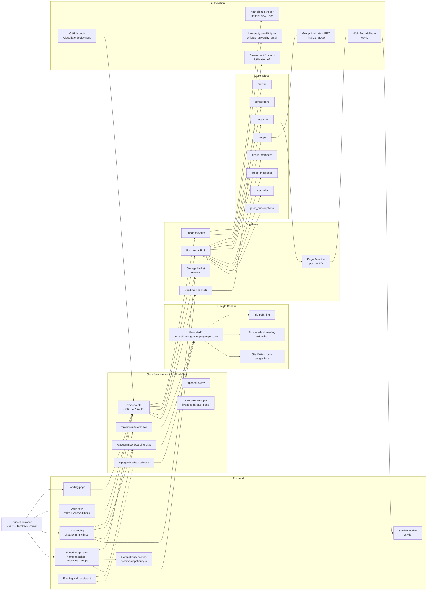

# Nido Architecture

Last updated: July 2, 2026

Nido is a TanStack Start + React app for lifestyle-based flatmate matching. The app is deployed as a Cloudflare Worker, uses Supabase for auth/data/storage/realtime, and uses Gemini for visible AI-assisted product features.

## System Diagram

## Frontend

The frontend lives in `src/routes`, `src/components`, `src/lib`, and `src/styles.css`.

- Framework: TanStack Start, TanStack Router, React, TypeScript, Tailwind CSS, shadcn/Radix primitives.
- Public routes:
  - `/` landing page.
  - `/auth` and `/auth/callback` for Supabase email auth.
- Protected routes under `/_authenticated`:
  - `/home` dashboard.
  - `/onboarding` profile setup with both chat and form modes.
  - `/matches` compatibility-ranked students.
  - `/connections` accepted connections.
  - `/messages` and `/messages/$id` direct messages.
  - `/groups`, `/groups/new`, and `/groups/$id` flatmate group flows.
  - `/profile/$id` public student profile view for signed-in users.
  - `/admin` password-gated admin review UI.
- Shared signed-in shell:
  - `src/components/nydo/AppShell.tsx` handles navigation, unread counts, push notification prompts, service worker registration, realtime notification listeners, and sign-out.
  - `src/components/nydo/SiteAssistant.tsx` mounts the floating AI assistant on signed-in pages except onboarding.

## Backend and Deployment

The deployed backend is the Cloudflare Worker entry in `src/server.ts`.

- `wrangler.jsonc` points Cloudflare at `src/server.ts`.
- `src/server.ts` wraps TanStack Start SSR and intercepts API paths before handing normal page requests to the TanStack server entry.
- Current API routes:
  - `GET /api/debug/env`: safe boolean-only runtime env visibility check.
  - `POST /api/gemini/profile-bio`: authenticated bio rewrite endpoint.
  - `POST /api/gemini/onboarding-chat`: authenticated onboarding chat endpoint. Also supports `mode: "site-assistant"` for the floating assistant fallback path.
  - `POST /api/gemini/site-assistant`: authenticated site assistant endpoint.
- Cloudflare runtime variables/secrets used by the Worker:
  - `GEMINI_API_KEY`
  - `GEMINI_MODEL` optional, defaults in code
  - `SUPABASE_URL` or `VITE_SUPABASE_URL`
  - `SUPABASE_PUBLISHABLE_KEY` or `VITE_SUPABASE_PUBLISHABLE_KEY`
- Deployment currently happens by pushing to GitHub and letting Cloudflare rebuild/redeploy the Worker.

## Database and Storage

Supabase is the source of truth. Migrations are in `supabase/migrations`.

Core tables:

- `profiles`: student profile, onboarding answers, lifestyle preferences, photo URL, completion state.
- `connections`: connection requests and accepted connections between students.
- `messages`: one-to-one direct messages. Includes generated `conversation_key`.
- `groups`: flatmate groups with `forming`, `locked`, or `dissolved` state.
- `group_members`: invited/confirmed/declined group membership.
- `group_messages`: group chat messages, only insertable when the group is locked.
- `user_roles`: admin/user role assignments.
- `push_subscriptions`: browser Web Push subscriptions per user.

Storage:

- Supabase Storage bucket `avatars` stores profile photos.
- Avatar objects are public-read and owner-managed through storage policies.

Important database functions and triggers:

- `handle_new_user`: creates a profile row when a Supabase Auth user is created.
- `enforce_university_email`: blocks signups that do not look like university emails.
- `touch_updated_at`: updates profile/connection timestamps.
- `has_role`: checks admin role membership.
- `is_group_member`: security-definer helper for group RLS.
- `finalize_group`: locks a group when all invited members confirm, dissolves it after declines or deadline.
- `admin_get_profiles` and `admin_get_groups`: password-gated admin RPCs.

Security model:

- Supabase RLS protects profile ownership, connection visibility, direct messages, group membership, group chat, roles, and push subscriptions.
- Server-side Gemini endpoints verify Supabase bearer tokens before calling Gemini.
- Gemini API keys remain server-side in Cloudflare secrets.

## Matching

Matching is deterministic scoring in `src/lib/compatibility.ts`.

- Inputs: lifestyle sliders, smoking, guests, diet, nationality, program, and `lifestyle_match_type`.
- Output: a compatibility score between 40 and 99 plus lifestyle tags.
- The current matching layer is not generative AI. It is explicit scoring logic, which is useful for explaining and debugging match behavior.

## AI Layer

Google Gemini is used for visible AI features through `src/lib/gemini.server.ts`.

Current AI features:

- Profile bio polish:
  - UI: onboarding form.
  - API: `/api/gemini/profile-bio`.
  - Purpose: rewrites a student bio while preserving facts.
- Chat onboarding:
  - UI: onboarding chat mode.
  - API: `/api/gemini/onboarding-chat`.
  - Purpose: asks follow-up questions and returns structured profile field patches.
- Voice-assisted onboarding:
  - UI: microphone button in onboarding chat.
  - Browser API: `SpeechRecognition` / `webkitSpeechRecognition`.
  - Important boundary: raw audio stays in the browser. Only transcribed text is sent to the Nido API/Gemini.
- Floating site assistant:
  - UI: `SiteAssistant`.
  - API: currently calls `/api/gemini/onboarding-chat` with `mode: "site-assistant"`; dedicated `/api/gemini/site-assistant` also exists.
  - Purpose: answers app-navigation questions and returns destination buttons like `/matches`, `/messages`, `/groups`, or `/onboarding`.

Gemini response handling:

- `src/lib/gemini.server.ts` calls the Gemini interactions endpoint.
- AI endpoints request JSON-shaped responses where structured data is needed.
- Server code sanitizes parsed fields and only returns allowed routes/fields to the client.

## Automation and Realtime

Automation currently comes from browser APIs, Supabase Realtime, Supabase Edge Functions, database triggers, and deployment hooks.

- Auth automation:
  - New Supabase Auth users automatically get a `profiles` row.
  - University email enforcement runs before user creation.
- Realtime automation:
  - Direct message pages subscribe to `messages` inserts.
  - Group pages subscribe to `group_members` changes and `group_messages` inserts.
  - `AppShell` subscribes to new message and connection inserts for notification badges/toasts.
- Notification automation:
  - `AppShell` registers `/sw.js` and stores browser push subscriptions in `push_subscriptions`.
  - Direct message sends invoke the `push-notify` Supabase Edge Function.
  - The Edge Function signs/encrypts Web Push payloads with VAPID keys, sends to stored endpoints, and removes stale subscriptions.
  - Browser `Notification` API is also used for immediate local notifications when permission is granted.
- Group automation:
  - `finalize_group` is invoked from group pages to lock or dissolve groups based on confirmations/deadlines.
- Deployment automation:
  - GitHub pushes trigger Cloudflare deployment.

## Environment Variables

Cloudflare Worker:

- `GEMINI_API_KEY`
- `GEMINI_MODEL` optional
- `SUPABASE_URL`
- `SUPABASE_PUBLISHABLE_KEY`

Frontend build/runtime:

- `VITE_SUPABASE_URL`
- `VITE_SUPABASE_PUBLISHABLE_KEY`

Supabase Edge Function `push-notify`:

- `SUPABASE_URL`
- `SUPABASE_SERVICE_ROLE_KEY`
- `VAPID_PUBLIC_KEY`
- `VAPID_PRIVATE_KEY`

## Known Architecture Notes

- Supabase generated TypeScript types appear behind the current database migrations. Full `tsc --noEmit` currently reports pre-existing type errors around `push_subscriptions`, some profile fields, and RPCs.
- `src/routeTree.gen 2.ts` exists as an untracked duplicate generated file and is not part of the committed app.
- `/api/debug/env` is useful for deployment debugging but should remain boolean-only and should not expose secret values.
- The general assistant is intentionally navigational/product-support oriented. It should not claim housing availability, pricing, legal advice, or personal facts it cannot verify.
